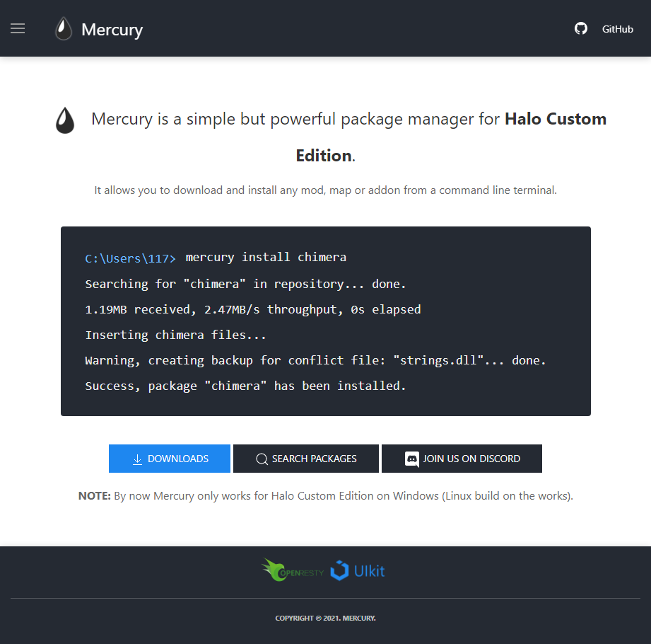

# Mercury Site

Mercury website files, built with [OpenResty](https://openresty.org/en/) and [UIKit3](https://getuikit.com/).

This project structure imitates a folders pattern from a React application under the HTML folder, pretty much all the site is statically compiled so other sources are converted into HTML for later usage, also some HTML are based on components that are dynamically prerendered on the server using [resty-template](https://github.com/bungle/lua-resty-template).